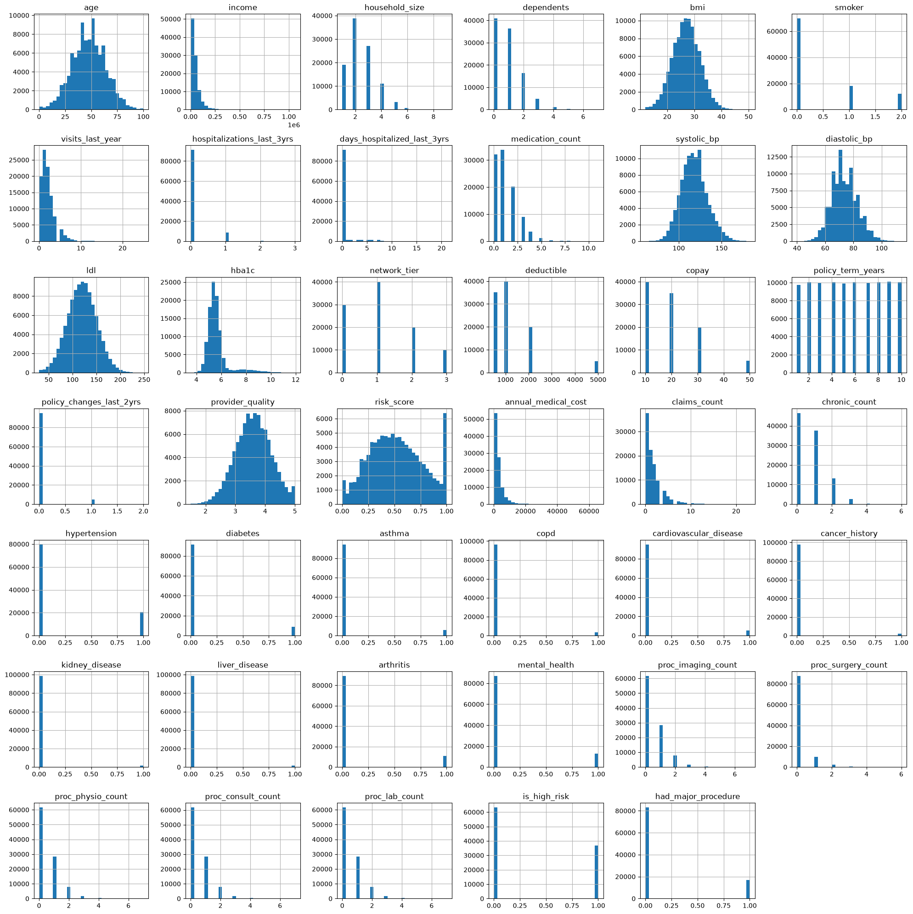
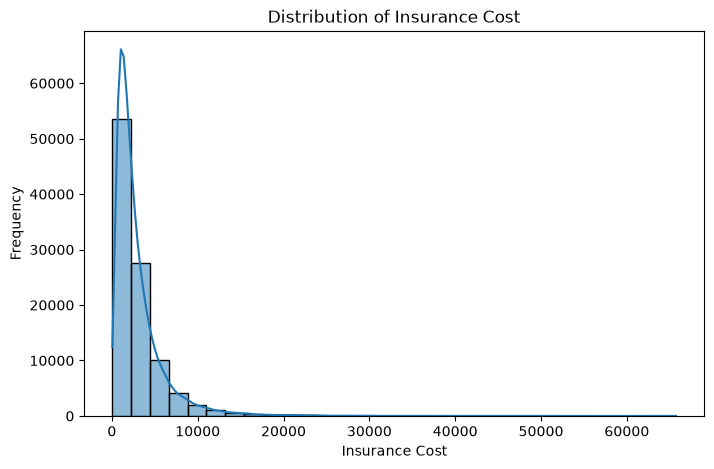

<div align="center">

# 🏥 Medical Insurance Cost Prediction

### Predicting Annual Medical Insurance Costs using Machine Learning Regression

*A hands-on, end-to-end regression project — from raw data to model evaluation — built as part of an ongoing machine learning learning journey.*

<br>

[](https://www.python.org/)
[](https://scikit-learn.org/)
[](https://pandas.pydata.org/)
[](https://numpy.org/)
[](https://jupyter.org/)
[](#-license)
[](#-future-improvements)

</div>

---

## 📑 Table of Contents

- [Project Overview](#-project-overview)
- [Features](#-features)
- [Dataset Information](#-dataset-information)
- [Project Workflow](#-project-workflow)
- [Data Preprocessing](#-data-preprocessing)
- [Exploratory Data Analysis](#-exploratory-data-analysis-eda)
- [Feature Engineering](#-feature-engineering)
- [Models Implemented](#-models-implemented)
- [Model Performance](#-model-performance)
- [Key Findings](#-key-findings)
- [Why Linear Models Performed Poorly](#-why-linear-models-performed-poorly)
- [Future Improvements](#-future-improvements)
- [Project Structure](#-project-structure)
- [Technologies Used](#-technologies-used)
- [Installation](#-installation)
- [Usage](#-usage)
- [Learning Outcomes](#-learning-outcomes)
- [Author](#-author)

---

## 📌 Project Overview

This project predicts **annual medical insurance costs** based on patient demographics, medical history, lifestyle habits, and insurance policy details.

It follows a complete, structured machine learning workflow — data cleaning, exploratory analysis, feature engineering, model building, and evaluation — with an emphasis on understanding *why* a model performs the way it does, rather than just reporting a final score.

> 🎯 **Goal:** Build a strong foundation in the end-to-end ML pipeline while progressively benchmarking increasingly powerful regression algorithms on the same dataset.

This is an **active, evolving project** — currently at the linear modeling stage, with tree-based and ensemble models planned next.

---

## ✨ Features

- 🧹 Clean, reproducible data preprocessing pipeline
- 📊 Rich exploratory data analysis with 40+ feature distributions
- 🔍 Data leakage detection and removal
- ⚙️ Categorical encoding (One-Hot + Ordinal) and feature scaling
- 📈 Multiple linear regression variants with cross-validation
- 🧾 Transparent, honest model evaluation (no inflated claims)
- 🔄 Structured for easy extension to advanced models

---

## 📊 Dataset Information

| Attribute | Details |
|---|---|
| **Size** | 100,000 records |
| **Target Variable** | `annual_medical_cost` |
| **Task Type** | Regression |
| **Source** | Kaggle |

<details>
<summary><b>📋 Click to view full feature list</b></summary>
<br>

**Demographics & Lifestyle**
`age`, `income`, `household_size`, `dependents`, `bmi`, `smoker`

**Medical History**
`visits_last_year`, `hospitalizations_last_3yrs`, `days_hospitalized_last_3yrs`, `medication_count`, `systolic_bp`, `diastolic_bp`, `ldl`, `hba1c`, `chronic_count`

**Chronic Conditions**
`hypertension`, `diabetes`, `asthma`, `copd`, `cardiovascular_disease`, `cancer_history`, `kidney_disease`, `liver_disease`, `arthritis`, `mental_health`

**Insurance Details**
`network_tier`, `deductible`, `copay`, `policy_term_years`, `policy_changes_last_2yrs`, `provider_quality`

**Procedures & Risk**
`proc_imaging_count`, `proc_surgery_count`, `proc_physio_count`, `proc_consult_count`, `proc_lab_count`, `risk_score`, `is_high_risk`, `had_major_procedure`, `claims_count`

</details>

---

## 🔄 Project Workflow


---

## 🛠 Data Preprocessing

The following preprocessing steps were applied before modeling:

- ✔️ Removed unnecessary and redundant columns
- ✔️ Handled missing values
- ✔️ Removed duplicate records
- ✔️ Encoded categorical features using:
  - One-Hot Encoding
  - Ordinal Encoding
- ✔️ Applied **StandardScaler** for feature scaling
- ✔️ Performed an 80:20 train-test split

---

## 📈 Exploratory Data Analysis (EDA)

Extensive EDA was carried out to understand feature behavior, spot outliers, and detect potential data leakage before training any model.

**Techniques used:**
- 📊 Histograms across all numerical features
- 📦 Boxplots for outlier detection
- 🔥 Correlation heatmap
- 📈 Scatter plots for relationship analysis

<div align="center">

**Feature Distributions Overview**


*Distribution of all numerical and categorical features in the dataset — used to identify skew, sparsity, and candidate features for engineering.*

<br>

**Target Variable Distribution**



*The target variable, `annual_medical_cost`, is heavily right-skewed — most patients incur relatively low costs, while a smaller group drives very high costs. This skew is a key factor in why linear models struggled (see [below](#-why-linear-models-performed-poorly)).*

</div>

EDA surfaced several important insights:

- Multiple features showed **strong correlation with the target that resembled data leakage** (e.g., variables that would only be known *after* a cost was already incurred). These were removed prior to training.
- The target variable is **non-normally distributed** with a long right tail.
- Several features (`hospitalizations_last_3yrs`, `chronic_count`, `risk_score`) showed non-linear relationships with cost.

---

## ⚙️ Feature Engineering

- Removed identified leakage-prone features to preserve model validity
- Converted categorical/ordinal insurance features (e.g. `network_tier`, `policy_term_years`) into model-ready numeric representations
- Standardized all continuous features for consistent scale across linear models
- Retained engineered risk indicators (`is_high_risk`, `risk_score`, `had_major_procedure`) as candidate predictors

---

## 🤖 Models Implemented

| Model | Status |
|---|---|
| Linear Regression | ✅ Implemented |
| Ridge Regression | ✅ Implemented |
| Lasso Regression | ✅ Implemented |
| Random Forest Regressor | 🔜 Planned |
| Decision Tree Regressor | 🔜 Planned |
| Support Vector Regression (SVR) | 🔜 Planned |
| Gradient Boosting | 🔜 Planned |
| XGBoost | 🔜 Planned |
| AdaBoost | 🔜 Planned |
| Extra Trees Regressor | 🔜 Planned |

Each implemented model was evaluated on both training and testing sets, with **cross-validation** used to sanity-check stability of the results.

---

## 📊 Model Performance

<div align="center">

| Model | Train R² | Test R² |
|:--|:--:|:--:|
| Linear Regression | 0.1726 | 0.1771 |
| Ridge Regression | 0.1726 | 0.1771 |
| Lasso Regression | 0.1726 | 0.1772 |

</div>

**Evaluation metrics used:**
`MAE` · `MSE` · `RMSE` · `R² Score` · `Cross-Validation`

> ℹ️ Reported scores reflect real, unmodified model output. No tuning or post-hoc adjustment was applied to inflate these results — they are presented as a genuine baseline for comparison against future models.

---

## 📌 Key Findings

- All three linear models converged to **nearly identical performance** (R² ≈ 0.17–0.18).
- Train and test scores are close to each other, indicating **underfitting**, not overfitting.
- Regularization (Ridge/Lasso) had **negligible effect**, suggesting the issue isn't overfitting-related variance, but a fundamental mismatch between model capacity and data structure.
- The dataset likely contains **non-linear relationships** between features (e.g., chronic conditions, hospitalization history) and cost that linear models cannot capture.

---

## 🔍 Why Linear Models Performed Poorly

A few likely explanations, based on the EDA and modeling results:

1. **Non-linear cost drivers** — Medical costs often scale non-linearly with risk factors (e.g., the jump in cost from 1 chronic condition to 3 is not proportional). Linear regression assumes additive, linear relationships and cannot represent this.
2. **Skewed target distribution** — `annual_medical_cost` is heavily right-skewed with a long tail of high-cost patients, which linear models tend to under-predict without transformation.
3. **Feature interactions** — Combinations of features (e.g., `smoker` × `age`, `chronic_count` × `hospitalizations_last_3yrs`) likely matter more than any single feature, and linear models don't capture interactions unless explicitly engineered.
4. **Thresholds and step-like effects** — Several features (`risk_score`, `is_high_risk`) show cliff-like effects on cost rather than smooth linear trends.

These observations directly motivate the move toward **tree-based and ensemble models**, which naturally handle non-linearity and feature interactions.

---

## 🚀 Future Improvements

This project is under **active development**. Planned next steps include:

- [ ] Implement Random Forest Regressor
- [ ] Implement Decision Tree Regressor
- [ ] Implement Support Vector Regression (SVR)
- [ ] Implement Gradient Boosting Regressor
- [ ] Implement XGBoost
- [ ] Implement AdaBoost
- [ ] Implement Extra Trees Regressor
- [ ] Hyperparameter tuning (GridSearch / RandomizedSearch)
- [ ] Advanced feature engineering (interaction terms, target transformation)
- [ ] Comprehensive model comparison dashboard
- [ ] Performance optimization and final model selection

---

## 🧰 Technologies Used

<div align="center">

| Category | Tools |
|---|---|
| **Language** | Python |
| **Data Handling** | Pandas, NumPy |
| **Visualization** | Matplotlib, Seaborn |
| **Modeling** | Scikit-Learn |
| **Environment** | Jupyter Notebook |

</div>

---

## 📁 Project Structure

```
Medical_Insurance_Cost_Prediction/
│
├── Medical_Insurance_Cost_Prediction.ipynb   # Main notebook (EDA + modeling)
├── README.md                                 # Project documentation
├── requirements.txt                          # Project dependencies
└── dataset/                                  # Raw dataset files
```

---

## 💻 Installation

Clone the repository and set up the environment:

```bash
# Clone the repository
git clone https://github.com/<your-username>/Medical_Insurance_Cost_Prediction.git
cd Medical_Insurance_Cost_Prediction

# (Optional) create a virtual environment
python -m venv venv
source venv/bin/activate      # On Windows: venv\Scripts\activate

# Install dependencies
pip install -r requirements.txt
```

---

## ▶️ Usage

1. Launch Jupyter Notebook:
   ```bash
   jupyter notebook
   ```
2. Open `Medical_Insurance_Cost_Prediction.ipynb`
3. Run all cells sequentially to reproduce:
   - Data preprocessing
   - EDA visualizations
   - Model training and evaluation

---

## 📚 Learning Outcomes

Through this project, I gained hands-on experience in:

- Data cleaning and preprocessing at scale (100K+ records)
- Exploratory data analysis and leakage detection
- Categorical encoding strategies (One-Hot vs. Ordinal)
- Feature scaling and its role in linear models
- Building and evaluating Linear, Ridge, and Lasso Regression
- Applying cross-validation for robust evaluation
- Interpreting model performance beyond a single metric
- Diagnosing underfitting vs. overfitting
- Structuring an end-to-end, portfolio-ready ML pipeline

---

## 👤 Author

**Krishna Lal**

[](https://github.com/Krishna-matic)
[](https://linkedin.com/in/krishna-lal-8563a6267)

---

<div align="center">

### ⭐ If you found this project helpful, consider giving it a star!

*This project is a work in progress — follow along as it evolves from linear baselines to advanced ensemble models.*

</div>
